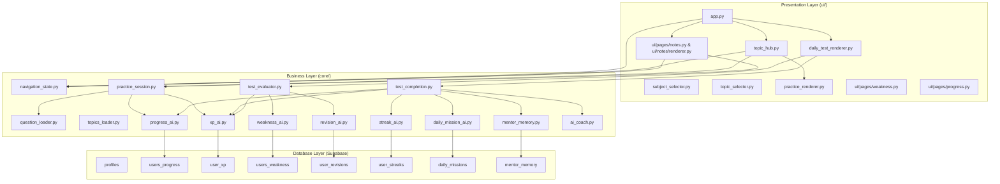
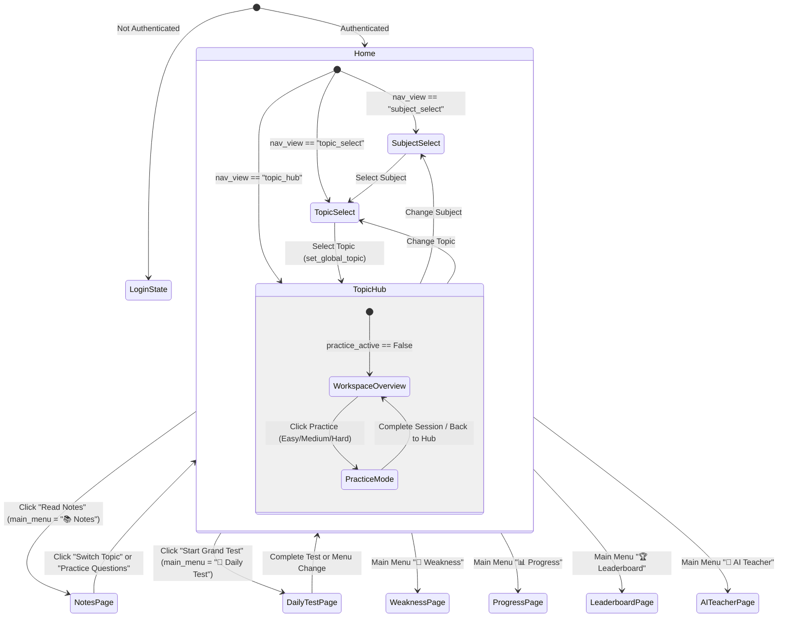

# TNPSC Nova AI — Study Cycle Architecture Analysis
## Phase 4A: Architectural Assessment & Integration Blueprint
**Role:** Lead Software Architect, TNPSC Nova AI  
**Date:** July 27, 2026  
**Status:** Pure Architecture Analysis (No Implementation / Code Changes Executed)  

---

## Executive Summary

This report provides a comprehensive, empirical architectural analysis of the **TNPSC Nova AI** learning application. Based on a deep-dive audit of the existing Python modules (`core/` and `ui/`), database interactions (`table_analysis.md`), state management routines, and navigation structures, this document outlines how all individual learning components operate today and details how they can be seamlessly linked into **ONE unified Study Cycle**.

No code modifications, refactorings, or file creations were made to the core system during this task. This analysis strictly adheres to the principle of **reusing existing module contracts and database architecture as much as possible**.

---

## 1. Current Architecture

The TNPSC Nova AI platform is built as a multi-tier Streamlit application backed by Supabase PostgreSQL.

```
┌───────────────────────────────────────────────────────────────────────────────────┐
│                                PRESENTATION TIER (UI)                             │
│  app.py (Main Router & Layout)                                                    │
│  ├── ui/navigation_v2/ (Subject Selector, Topic Selector, Topic Hub Workspace)   │
│  ├── ui/notes/ (Bilingual Notes Renderer & Component Registry)                   │
│  ├── ui/question_engine/ (Universal Question Renderer & Practice Workspace)       │
│  ├── ui/pages/ (Daily Test Renderer, Weakness, Progress, Leaderboard, AI Coach)   │
│  └── ui/components/ & ui/theme.py (Glassmorphic CSS & UI Components)             │
└─────────────────────────────────────────┬─────────────────────────────────────────┘
                                          │
                                          ▼
┌───────────────────────────────────────────────────────────────────────────────────┐
│                                BUSINESS & AI TIER (CORE)                          │
│  ├── core/navigation_v2/navigation_state.py (Global Subject & Topic State)       │
│  ├── core/question_engine/ (Practice Session Manager, Validators, Models)        │
│  ├── core/question_loader.py & core/topics_loader.py (JSON Repositories Loader)  │
│  ├── core/xp_ai.py (XP Progression & Level Engine)                               │
│  ├── core/weakness_ai.py & test_weakness.py (Weakness Calculation Engine)        │
│  ├── core/revision_ai.py & revision_scheduler.py (Spaced Repetition SM-2 Engine)  │
│  ├── core/daily_mission_ai.py & streak_ai.py (Daily Goals & Streak Tracker)      │
│  ├── core/progress_ai.py & dashboard_stats_ai.py (Analytics & Progress Engine)    │
│  └── core/ai_coach.py, mentor_ai.py, mentor_memory.py (AI Tutoring & Context)     │
└─────────────────────────────────────────┬─────────────────────────────────────────┘
                                          │
                                          ▼
┌───────────────────────────────────────────────────────────────────────────────────┐
│                               DATA & STORAGE TIER                                 │
│  ├── Supabase PostgreSQL Database (profiles, users_progress, user_xp,             │
│  │   users_weakness, user_revisions, user_streaks, daily_missions, mentor_memory)│
│  └── Data Repositories (data/notes/<subject>/*.json, data/questions/<subject>/*.json)│
└───────────────────────────────────────────────────────────────────────────────────┘
```

---

## 2. Current Learning Flow

The actual user navigation flow in the current application operates as follows:

```
[Login Screen / Restoration]
             │
             ▼
      [🏠 Home Page]
             │
             ├──► (View: "subject_select") ──► Select Subject (e.g. Polity)
             │                                          │
             ├──► (View: "topic_select") ◄──────────────┘
             │           │
             │           ▼ Select Topic (e.g. Historical Background Part 1)
             │
             └──► (View: "topic_hub") ──► [🎯 Topic Hub Workspace]
                                               │
           ┌───────────────────────────────────┼───────────────────────────────────┐
           │                                   │                                   │
           ▼                                   ▼                                   ▼
 [Click "Read Notes"]               [Click "Start Practice"]            [Click "Start Grand Test"]
           │                                   │                                   │
           ▼                                   ▼                                   ▼
Changes st.session_state           Renders Practice Workspace          Changes st.session_state
["main_menu"] = "📚 Notes"          Inline inside Topic Hub             ["main_menu"] = "📘 Daily Test"
           │                                   │                                   │
           ▼                                   │                                   ▼
  [📚 Notes Page]                              │                            [📘 Daily Test Page]
           │                                   │                                   │
  [Click "Practice Questions"]                 │                         Completes 10 Questions
           │                                   │                                   │
           ▼                                   │                                   ▼
Sets practice_active = True                    ▼                            Triggers complete_test()
Redirects to "🏠 Home"              [Practice Questions Session]         (Updates XP, Weakness,
           │                                   │                         Revision, Streak, Missions)
           └──────────────────────────►        │                                   │
                                               ▼                                   ▼
                                    Completes All Questions                 Displays Score Result
                                               │                                   │
                                               ▼                                   ▼
                                    Calls complete_practice_session()    User manually clicks
                                    (Updates progress & Practice XP)     sidebar menu item
                                               │                         to continue learning
                                               ▼
                                    Displays Practice Summary UI
                                               │
                                               ▼
                                    User clicks "Back to Hub"
```

---

## 3. Existing Learning Modules

| # | Module Name | Purpose | Entry Point | Exit Point | Input | Output | Session Variables Used | Database Tables Used | Dependencies | Current Navigation |
|---|---|---|---|---|---|---|---|---|---|---|
| **1** | **Dashboard** | Visual high-level user performance & stats summary | `main_menu == "🏠 Home"` (Tab: Performance Dashboard) | Menu selection or button click | `username` / `user_id` | Statistics cards, mastery charts, level indicators | `tests_attempted`, `accuracy`, `streak`, `rank`, `weak_subject`, `xp`, `xp_level` | `users_progress`, `user_xp`, `users_weakness`, `user_streaks`, `profiles` | `core.dashboard_stats_ai`, `core.progress_ai` | Sub-tab in `🏠 Home` |
| **2** | **Subject Selection** | Grid selection of available TNPSC subjects | `nav_view == "subject_select"` | Click subject card -> `nav_view = "topic_select"` | User click | Sets `selected_subject` | `selected_subject`, `nav_view` | None (Local directory scan `data/notes/`) | `core.navigation_v2.navigation_state` | View state in `🏠 Home` |
| **3** | **Topic Selection** | Displays syllabus topics & sub-parts for a subject | `nav_view == "topic_select"` | Click topic card -> `nav_view = "topic_hub"` | `selected_subject` | Sets topic metadata | `selected_subject`, `selected_topic_id`, `selected_repository_id`, `nav_view` | None (Local JSON scan `data/topics/`) | `core.topics_loader`, `core.navigation_v2.navigation_state` | View state in `🏠 Home` |
| **4** | **Topic Hub Workspace** | Central command center for selected topic & repository launcher | `nav_view == "topic_hub"` | Button click to Notes, Practice, Grand Test, AI Teacher | Topic metadata (`selected_topic_id`) | Topic mastery %, module cards grid, availability status | `selected_subject`, `selected_topic_id`, `selected_repository_id`, `active_practice_setup`, `practice_active` | `users_progress` (via `get_progress`) | `core.navigation_v2.navigation_state`, `core.question_engine.practice_session` | Tab 1 in `🏠 Home` |
| **5** | **Notes Module** | Structured bilingual (EN/TA) notes renderer | `main_menu == "📚 Notes"` OR Topic Hub launcher | "Switch Topic" button OR "Practice Questions" button | `selected_subject`, `selected_topic_id` | Structured HTML/Streamlit notes view | `selected_subject`, `selected_topic_id`, `selected_repository_id`, `main_menu` | None (Reads `data/notes/<subject>/<topic_id>.json`) | `ui.notes.renderer`, `core.streamlit_ui_engine`, `core.navigation_v2.navigation_state` | Main Menu `📚 Notes` |
| **6** | **Universal Practice / Practice Workspace** | Full-repository practice engine with palette & instant feedback | Topic Hub repository card ("Start Easy", "Start Medium", etc.) | "Complete Practice Session" OR "Back to Hub" | `repository_id`, `repository_type` | Question cards, instant validation, practice summary | `practice_active`, `practice_questions`, `practice_current_index`, `practice_score`, `practice_answers`, `practice_completed` | `users_progress`, `user_xp` | `core.question_engine.practice_session`, `ui.question_engine.practice_renderer` | Rendered conditionally in Topic Hub |
| **7** | **Daily Test Engine** | 10-Question sequential daily test runner | `main_menu == "📘 Daily Test"` | Question 10 completion -> Result Screen | Test mode ("daily", "weak", "revision") | Test score, level adjustment, engine updates | `test_active`, `test_mode`, `test_qs`, `q_index`, `score`, `answered`, `correct_streak`, `wrong_count` | `users_progress`, `user_xp`, `users_weakness`, `user_revisions`, `user_streaks`, `daily_missions` | `core.question_loader`, `core.test_evaluator`, `core.test_completion` | Main Menu `📘 Daily Test` |
| **8** | **Result Engine** | Evaluates test score, triggers 6-engine cascade, displays summary | Automatic end of Daily Test or Practice Session | User navigation back to menu | Session answers & score | XP rewards, streak increment, weakness updates, AI Coach message | `test_results_processed`, `practice_results_processed`, `mentor_chat`, `xp_level_up` | `users_progress`, `user_xp`, `user_streaks`, `daily_missions`, `users_weakness`, `mentor_memory` | `core.test_completion`, `core.ai_coach`, `core.mentor_memory`, `core.streak_ai` | Screen within Daily Test / Practice |
| **9** | **XP Engine** | XP point calculation & level progression | Invoked during answer evaluation & test/practice completion | Returns XP & level status | `user_id`, `amount`, `reward_type` | Updated XP record, level up triggers | `xp`, `xp_level`, `xp_level_up`, `test_start_xp` | `user_xp` | `core.xp_ai`, `core.user_identity` | Background service |
| **10**| **Weakness Engine** | Tracks subject/topic weakness based on wrong test answers | Answer evaluation or Main Menu `🧠 Weakness` | Weakness view or launch Weak Practice | `user_id`, `subject`, `topic` | Weakness score updates, weak topic recommendations | `weak_subject`, `test_mode` | `users_weakness` | `core.weakness_ai`, `core.test_weakness`, `ui.pages.weakness` | Background service + Main Menu `🧠 Weakness` |
| **11**| **Revision Engine** | Spaced-repetition (SuperMemo-2) scheduling queue | Answer evaluation in revision mode | Next revision timestamp update | `user_id`, `subject`, `topic` | Updated `user_revisions` table | `test_mode` | `user_revisions` | `core.revision_ai`, `core.test_revision`, `core.revision_scheduler` | Background service |
| **12**| **Daily Mission Engine** | Tracks daily goals (Daily Test, PYQs, Revision, Streak) | Answer submission & test completion | Mission checkbox state updates | `user_id`, action type | Updated `daily_missions` table | `daily_test_completed`, `pyq_solved`, `revision_completed` | `daily_missions` | `core.daily_mission_ai` | Background service |
| **13**| **Streak Engine** | Daily active streak tracker | Invoked inside `complete_test()` | Updated streak days | `user_id` | Incremented streak record, streak XP bonuses | `streak`, `rank` | `user_streaks` | `core.streak_ai` | Background service |
| **14**| **Study Analytics / Progress** | Historical trends & subject mastery charts | Main Menu `📊 Progress` | Interactive chart viewing | `user_id` | Plotly charts, attempt log table | `tests_attempted`, `accuracy` | `users_progress` | `core.progress_ai`, `ui.pages.progress` | Main Menu `📊 Progress` |
| **15**| **Leaderboard** | Global aspirant rank ordering based on XP | Main Menu `🏆 Leaderboard` | Rank inspection | None | Global leaderboard ranking | `rank`, `xp` | `user_xp`, `profiles` | `core.leaderboard_ai`, `ui.pages.leaderboard` | Main Menu `🏆 Leaderboard` |
| **16**| **AI Teacher & Mentor** | Interactive AI tutoring & personalized coaching | Main Menu `🤖 AI Teacher` / `👨‍🏫 Personal Mentor` | Chat conversation | User prompt + performance context | Explanations, memory tricks, study recommendations | `mentor_chat`, `teacher_prompt`, `mentor_notification` | `mentor_memory` | `core.ai_teacher`, `core.mentor_ai`, `core.mentor_memory` | Main Menu items |

---

## 4. Module Dependency Diagram



---

## 5. Navigation Diagram



---

## 6. Session State Flow

The application currently manages session state using two distinct key namespaces:

### A. Navigation & Global State
- `st.session_state["selected_subject"]`: Permanent subject key (e.g. `"polity"`).
- `st.session_state["selected_topic_id"]`: Permanent topic identifier (e.g. `"polity_historical_background_part1"`).
- `st.session_state["selected_repository_id"]`: Question repository identifier (e.g. `"polity_historical_background"`).
- `st.session_state["selected_topic_metadata"]`: Complete topic metadata dictionary.
- `st.session_state["nav_view"]`: View switcher (`"subject_select"`, `"topic_select"`, `"topic_hub"`).
- `st.session_state["main_menu"]`: Main menu selection string.

### B. Practice Workspace Session Keys (`practice_*`)
- `st.session_state["practice_active"]`: Boolean flag controlling inline Practice Workspace rendering.
- `st.session_state["practice_questions"]`: Full list of loaded question dictionaries.
- `st.session_state["practice_current_index"]`: Current 0-based question index.
- `st.session_state["practice_score"]`: Number of correct answers in session.
- `st.session_state["practice_answers"]`: Dict mapping `question_index` to user answer details.
- `st.session_state["practice_completed"]`: Boolean flag indicating session end.
- `st.session_state["practice_results_processed"]`: Guard flag preventing double DB writes.

### C. Daily Test Session Keys (`test_*`)
- `st.session_state["test_active"]`: Boolean flag controlling Daily Test session.
- `st.session_state["test_mode"]`: Test type (`"daily"`, `"weak"`, `"revision"`, `"notes_practice"`, `"grand_test"`).
- `st.session_state["test_qs"]`: 10-question sample list.
- `st.session_state["q_index"]`: Current question index.
- `st.session_state["score"]`: Score accumulator.
- `st.session_state["test_results_processed"]`: Guard flag preventing double DB writes.

---

## 7. Database Interaction Summary

| Database Table | Primary Engine | Access Method | Operations Executed | Primary Key / Index Filter |
|---|---|---|---|---|
| `public.profiles` | Identity & Leaderboard | Supabase Client | `SELECT` | `id` (UUID) |
| `public.users_progress` | Progress & Topic Hub | `core.progress_ai` | `SELECT`, `INSERT` | `user_id` (UUID) |
| `public.user_xp` | XP & Leveling | `core.xp_ai` | `SELECT`, `INSERT`, `UPDATE` | `user_id` (UUID) |
| `public.users_weakness` | Weakness Engine | `core.weakness_ai` | `SELECT`, `INSERT`, `UPDATE`, `DELETE` | `user_id` (UUID) |
| `public.user_revisions` | Spaced Repetition | `core.revision_ai` | `SELECT`, `INSERT`, `UPDATE` | `user_id` (UUID) |
| `public.user_streaks` | Daily Streak Tracker | `core.streak_ai` | `SELECT`, `INSERT`, `UPDATE` | `user_id` (UUID) |
| `public.daily_missions` | Daily Mission Engine | `core.daily_mission_ai` | `SELECT`, `INSERT`, `UPDATE` | `user_id` (UUID) |
| `public.mentor_memory` | AI Coach Context | `core.mentor_memory` | `SELECT`, `INSERT`, `UPDATE` | `user_id` (UUID) |

---

## 8. Practice Repository Analysis

### How Subject, Topic, and Repository are Selected
1. Subject is chosen in `ui/navigation_v2/subject_selector.py` -> sets `selected_subject`.
2. Topic is chosen in `ui/navigation_v2/topic_selector.py` -> calls `set_global_topic(subject, topic_id)`.
3. `set_global_topic()` resolves the exact `repository_id` from metadata (e.g. `polity_historical_background`).

### Practice Repositories Execution
- **Easy, Medium, Hard, Statement-Based, Assertion & Reason, Match the Following, Chronology, and PYQ Practice**:
  - Launching any practice repository calls `start_practice_session(subject, topic_id, repository_id, display_title, repository_type)`.
  - Questions are loaded from `data/questions/<subject>/<repository_id>_<type>.json` via `load_questions()`.
  - The Practice Workspace (`ui/question_engine/practice_renderer.py`) displays the questions with an interactive palette.
  - On completion, `complete_practice_session()` saves progress to `users_progress` DB and awards Practice XP (+10 XP per correct question).

---

## 9. Notes Module Analysis

### Loading Mechanism
- Notes are JSON files stored under `data/notes/<subject>/<topic_id>.json`.
- `ui/pages/notes.py` resolves the path dynamically based on `selected_subject` and `selected_topic_id`.
- Function `@st.cache_data load_note(file_path)` parses and caches the JSON file.

### Content Structure & Rendering
- Loaded JSON contains structured sections: `definition`, `historical_background`, `salient_features`, `important_articles`, `schedules`, `amendments`, `important_facts`.
- Rendered via `ui/notes/renderer.py` and `core/streamlit_ui_engine.py`.
- Features bilingual tab toggling (`EN` / `TA`) for all text blocks and points lists.

### Exit Point
- At the bottom of the page, a prominent button `"🧠 Practice Questions for this Topic"` launches `start_practice_session(..., "easy")` and switches navigation back to `🏠 Home`.

---

## 10. Result Engine Analysis

Currently, the system contains **two distinct result engines**:

### Engine A: Daily Test Completion (`core/test_completion.py`)
- **Trigger**: Automatic when `q_index >= total_q` in `📘 Daily Test`.
- **Automated Engine Cascade**:
  1. `ai_coach()` generates personalized guidance text.
  2. Updates `st.session_state.mentor_chat` and sets `mentor_notification = True`.
  3. Updates `mentor_memory` database table.
  4. Updates `user_streaks` database table (+1 day).
  5. Updates `user_xp` database table (+50 completion, +50 perfect score bonus, +100 7-day streak bonus).
  6. Saves record to `users_progress` database table.
  7. Updates `daily_missions` database table (`daily_test_completed = True`).

### Engine B: Practice Session Completion (`core/question_engine/practice_session.py`)
- **Trigger**: User clicks `"Complete Practice Session"` in Practice Workspace.
- **Automated Engine Cascade**:
  1. Saves record to `users_progress` database table.
  2. Awards Practice XP (+10 XP / correct answer) to `user_xp` database table.
  3. Displays practice summary UI.
- **Missing Triggers in Engine B**: Does NOT update Weakness Engine, Revision Engine, Streaks, Daily Missions, or Mentor Memory.

---

## 11. Current User Journey

```
1. User logs in.
2. Navigates to Topic Hub under "🏠 Home".
3. Clicks "Read Notes" -> Page jumps to "📚 Notes" menu item.
4. Reads notes -> Clicks "Practice Questions for this Topic" -> Page jumps back to "🏠 Home" Practice Workspace.
5. Solves practice questions -> Clicks "Complete Practice Session".
6. Sees Practice Summary -> Clicks "Back to Topic Hub".
7. Wants to take a daily or weak topic test -> Clicks "📘 Daily Test" in sidebar.
8. Completes test -> Sees result screen & AI Coach feedback.
9. Wants to view progress -> Clicks "📊 Progress" in sidebar.
```

---

## 12. Problems Identified (Study Cycle Friction)

1. **Menu Hopping & Disconnected Views**:
   - Reading notes takes the user out of `🏠 Home` to `📚 Notes`.
   - Starting a Grand Test jumps the user to `📘 Daily Test`.
   - Practice runs inline inside `🏠 Home`, creating inconsistent navigation mental models.

2. **Inconsistent Engine Updates**:
   - Completing a Practice Session only updates Progress & XP tables.
   - Weakness scores, Spaced Repetition queues, Daily Missions, Streaks, and AI Mentor Context are ONLY updated when taking tests inside `📘 Daily Test`.

3. **Duplicated Configuration**:
   - The Topic Hub has a specific selected topic (`selected_topic_id`), but launching a Daily Test re-queries test configurations independently, ignoring what the user was just studying.

4. **Fragmented User Feedback**:
   - AI Coach feedback is only generated during Daily Tests, leaving Topic Hub Practice completion without personalized AI insights.

---

## 13. Integration Opportunities (The Unified Study Cycle)

By orchestrating existing functions without changing core algorithms, we can unify the study cycle into ONE seamless flow:

```
┌───────────────────────────────────────────────────────────────────────────────────┐
│                             UNIFIED STUDY CYCLE FLOW                              │
└───────────────────────────────────────────────────────────────────────────────────┘
                                         │
                                         ▼
                     Step 1: Select Subject & Topic in Topic Hub
                                         │
                                         ▼
                     Step 2: Read Topic Notes (Inline / Seamless Bridge)
                                         │
                                         ▼
                     Step 3: Practice Questions (Easy -> Medium -> Hard)
                                         │
                                         ▼
                     Step 4: Result Engine Cascade (Automated Integration)
                         ├── Save Progress (users_progress)
                         ├── Award XP & Level Check (user_xp)
                         ├── Update Weakness Scores (users_weakness)
                         ├── Update Revision Queue (user_revisions)
                         ├── Increment Daily Streak (user_streaks)
                         ├── Check off Daily Mission (daily_missions)
                         └── Update AI Mentor Memory (mentor_memory)
                                         │
                                         ▼
                     Step 5: Recommended Next Step (Auto-suggested)
                         ├── Next difficulty repository OR
                         ├── Practice Weak Topics OR
                         └── Mastered (Topic Complete)
```

---

## 14. SAFE TO MODIFY

The following files contain UI orchestration and glue logic that can be safely modified during implementation phases to link the study cycle:

- `ui/navigation_v2/topic_hub.py` (To present a single unified inline study cycle workspace)
- `ui/pages/notes.py` (To embed or seamlessly bridge notes inside the topic workspace)
- `core/question_engine/practice_session.py` (To trigger the full 6-engine cascade upon practice completion)
- `ui/question_engine/practice_renderer.py` (To display next-step recommendations upon completing practice)
- `app.py` (To simplify main menu routing and maintain session context)

---

## 15. DO NOT MODIFY

The following core algorithm, schema, and data files **MUST NOT BE TOUCHED**:

- `core/auth.py` & `core/session.py` (Authentication and session restoration logic)
- `core/supabase_client.py` & Database Schemas (`profiles`, `users_progress`, `user_xp`, etc.)
- `core/xp_ai.py` (XP reward rates and level threshold formulas)
- `core/weakness_ai.py` (Weakness math and scoring logic)
- `core/revision_ai.py` & `core/revision_scheduler.py` (SuperMemo-2 spaced repetition math)
- `core/streak_ai.py` (Streak calculation logic)
- `core/daily_mission_ai.py` (Daily mission criteria)
- `core/ai_teacher.py`, `core/mentor_ai.py`, `core/mentor_memory.py` (AI prompts and memory parsing)
- Local Data Repositories (`data/notes/*.json`, `data/questions/*.json`, `data/topics/*.json`)

---

## 16. Risk Assessment

| Risk Description | Severity | Impact | Mitigation Strategy |
|---|---|---|---|
| **Double XP Awarding** | High | User gains double XP if practice and test completion both fire | Implement `results_processed` boolean flags to enforce idempotent single-execution. |
| **Infinite Rerun Loops** | Medium | State changes during Streamlit render cause infinite refreshes | Perform state updates before `st.rerun()` calls and use explicit navigation flags. |
| **Session Key Collisions** | Medium | Mixing `practice_*` and `test_*` session keys causes state corruption | Keep `practice_*` namespace strictly isolated for repository practice. |
| **Unintended Breaks in Daily Test** | Low | Modifying shared completion functions breaks Daily Test | Call existing engine functions (`add_weakness`, `update_revision`, `update_streak`) directly from `complete_practice_session()` without altering `complete_test()`. |

---

## 17. Recommended Implementation Order (Phase 4A Sprints)

To implement the unified Study Cycle safely without regressions, the work should be broken down into three focused sprints:

### Sprint 1: Result Engine Integration
- **Objective**: Connect Topic Hub Practice completion (`complete_practice_session`) to the remaining 4 engines (`users_weakness`, `user_revisions`, `user_streaks`, `daily_missions`).
- **Files Modified**: `core/question_engine/practice_session.py`.
- **Verification**: Complete an Easy practice repository and verify that records update in all 6 database tables.

### Sprint 2: Notes & Practice Seamless Bridge
- **Objective**: Allow users to read notes directly within Topic Hub or transition back to Topic Hub practice without changing main menu items.
- **Files Modified**: `ui/pages/notes.py`, `ui/navigation_v2/topic_hub.py`.
- **Verification**: Navigate from Topic Hub to Notes and launch Practice; confirm zero menu jump disorientation.

### Sprint 3: Study Cycle Progression & Guidance
- **Objective**: Render "Recommended Next Step" buttons on the Practice Summary screen (e.g. "Proceed to Medium Repository", "Revise Weak Topics").
- **Files Modified**: `ui/question_engine/practice_renderer.py`, `ui/navigation_v2/topic_hub.py`.
- **Verification**: Walk through a complete Study Cycle: Select Topic -> Read Notes -> Easy Practice -> Result Engine -> Medium Practice -> Topic Mastery.

---

**AWAITING APPROVAL:**  
Phase 4A Architecture Analysis is complete. No code changes have been executed. Please review this report and provide approval to proceed with Phase 4A Sprint 1 implementation.
